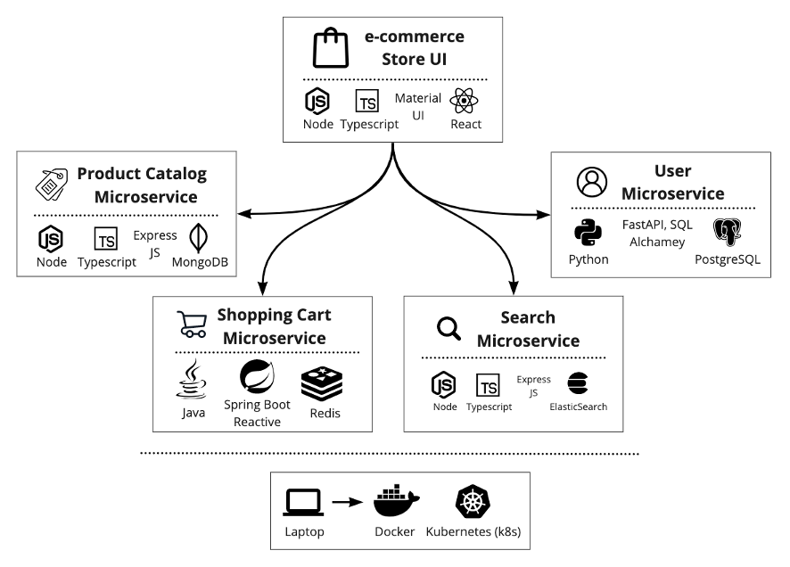
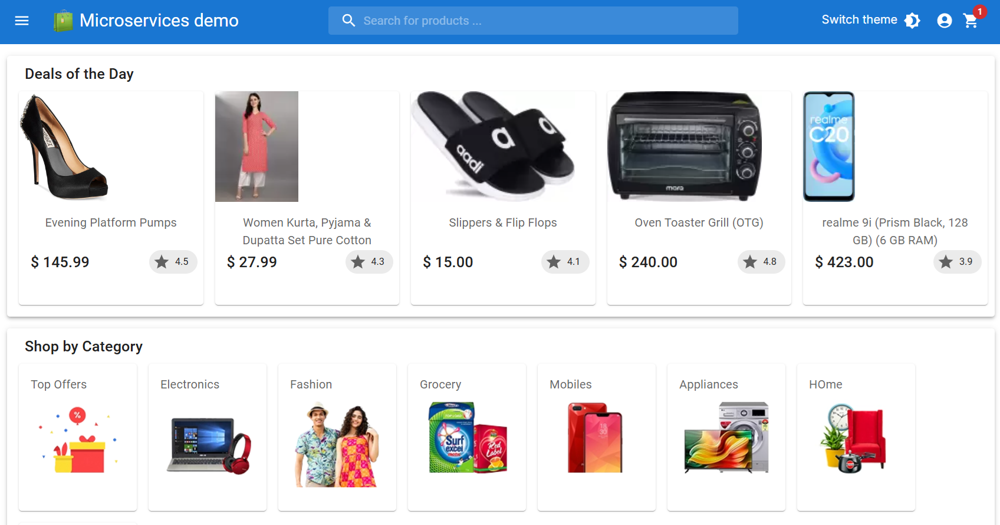

# Sample E-Commerce application using Microservices
**_An e-commerce sample application built using Microservices Architecture patterns._**
- **Languages & Frameworks** (Java - Spring Boot/Cloud, Python - FastAPI, SQLAlachamey, JavaScript/TypeScript - Node, ExpressJS, React)
- **Databases** (MongoDB, Redis, ElasticSearch, PostgreSQL)
- Able to deploy to **local Kubernetes (k8s) cluster** as containers (Docker).

This is an end-to-end **e-commerce solution** that demonstrates how to build a moder application using microservices architecture with full-stack technologies. This application includes below functional microservices which are independently deployable with bounded context.

_You can start application locally on your laptop/desktop with few steps._

## App -  UI/UX, Architecture & Technologies Used

Architecture         |  Application UI/UX
:-------------------------:|:-------------------------:
 |  

## Functional Microservices
| Microservice  | Description | Technologies Used                                                                                              |
| --- | --- |----------------------------------------------------------------------------------------------------------------|
| [Product Catalog Microservice](products-service/README.md) | Provides e-commerce merchandise information and images. | A REST API built using NodeJS, ExpressJS relies MongoDB as a data store.                                       | 
| [Shopping Cart Microservice](cart-cna-microservice/README.md) |  A Microservice with shopping cart and checkout features. | A REST API built using Spring Boot & Cloud with Gradle as build tool, leverages Redis as in-memory data store. |
| [User Profile Microservice](users-service/README.md) | User profile management, account and more. | A REST API built using Python FastAPI and SQLAlchamey used PostreSQL (still developing...)                     |
| [Search Microservice](search-service/README.md) | Enables seach functionality such as auto complete, typeahead, faceted search features | A proxy to ElasticSearch, leverages Node (still developing...)                                                                    |
| [Store UI](store-ui/README.md) | A web UI frontend for e-commerce store that uses above Microservices | A web app built using React, Material UI using TypeScript/JavaScript                                           |

## Folder Structure
```bash
.
├── cart-service                # Shopping Cart Microservice repository
└── infra                       # Infrastructure scripts to setup app locally & cloud
    ├── k8s                     # Kubernetes (k8s) YAML files
    │    └── apps               # Microservices related k8s yaml files.
    │    └── shared-services    # Databases, ElasticSearch related k8s yaml files.
├── products-service            # Product Catalog Microservice folder
├── search-service              # Search Microservice
├── store-ui                    # Web Store React App with Material UI
├── users-service               # User Profile Management Microservice
```

## Getting Started

### Build
Go through detailed instructions specified in README.md file of each microservice.

### Deploy
Refer to [instructions](infra/README.md) to deploy application and dependent services such as MongoDB, Redis, ElasticSearch, ...

